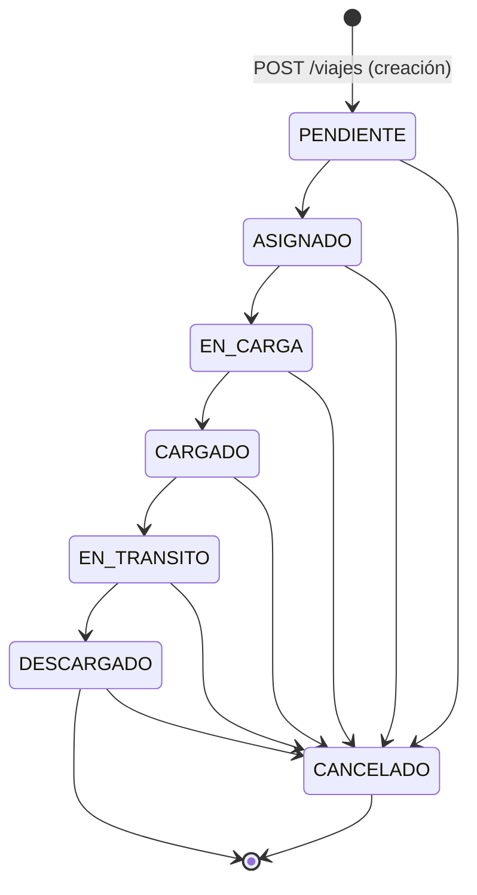

# AUDITORÍA VIAJES 2.0 — GESTIÓN OPERATIVA
## Bloque 1: Núcleo (Viaje / HistorialEstadoViaje)

**Tipo:** Auditoría funcional y técnica. Sin implementación, sin commits, sin push.

**Alcance de este documento:** exclusivamente el ciclo de vida propio del Viaje: modelo `Viaje`, modelo `HistorialEstadoViaje`, `backend/src/viajes/viajes.controller.ts` (con sus DTOs), `frontend/src/pages/Viajes.tsx` (listado) y `frontend/src/pages/ViajeDetalle.tsx` (detalle). Se cita también `frontend/src/pages/ViajeForm.tsx` cuando es directamente relevante para el estado inicial del Viaje.

**Explícitamente fuera de alcance en este documento** (se auditarán en bloques posteriores, según lo indicado): Liquidaciones, Facturas, Anticipos, y cualquier integración futura. Donde el núcleo de Viajes depende de esos módulos (los campos `estadoFacturacion` y `estadoLiquidacion`), se documenta el acoplamiento tal como se ve **desde adentro de `viajes.controller.ts`**, sin auditar cómo esos otros controllers los modifican.

---

## 1. Estados existentes

El estado operativo del Viaje vive en el campo `Viaje.estado`, tipado con el enum de Prisma `EstadoViajeEnum` (`backend/prisma/schema.prisma:20-28`):

| Estado | Significado | Es terminal | Notas |
|---|---|---|---|
| `PENDIENTE` | Estado inicial, asignado automáticamente al crear el Viaje. | No | Único estado que se asigna sin pasar por `POST /viajes/:id/estado`. |
| `ASIGNADO` | Recursos (chofer/camión) confirmados para el viaje. | No | |
| `EN_CARGA` | El camión está cargando en el origen. | No | |
| `CARGADO` | Carga completada, pendiente de iniciar tránsito. | No | |
| `EN_TRANSITO` | El camión está en ruta hacia el destino. | No | |
| `DESCARGADO` | Carga entregada en destino. | Sí (para el flujo normal) | Es el único estado desde el que `GET /viajes/pendientes-facturar` considera un Viaje facturable (`viajes.controller.ts:110`). No existen estados "Liquidado" ni "Cerrado" en este enum — ver hallazgo R-8. |
| `CANCELADO` | Viaje cancelado. | Sí | Alcanzable desde cualquier estado no terminal, no solo desde el final del flujo (ver §2). |

**Hallazgo de nomenclatura:** el enunciado original del bloque (Creado → En curso → Finalizado → **Liquidado** → **Cerrado**) no corresponde a los valores reales de `EstadoViajeEnum`. "Liquidado" y "Cerrado" no son estados del Viaje: `estadoLiquidacion` es un campo **separado** (`EstadoLiquidacionItemEnum`: `PENDIENTE`/`LIQUIDADO`/`PAGADO`, `schema.prisma:38-42`) que vive en paralelo a `estado`, no como parte de la misma máquina de estados. No existe ningún valor "Cerrado" en ningún enum del núcleo de Viaje. Esto se retoma en el diagrama de §2.

**Dónde se declara el orden operativo:** el array `ORDEN_ESTADOS` en `viajes.controller.ts:15` —

```ts
const ORDEN_ESTADOS = ["PENDIENTE", "ASIGNADO", "EN_CARGA", "CARGADO", "EN_TRANSITO", "DESCARGADO"];
```

— define la secuencia válida. `CANCELADO` queda deliberadamente fuera de este array y se maneja como caso especial (§2).

**Duplicación de la lista de estados (sin fuente única de verdad):** el mismo conjunto de valores aparece hardcodeado, de forma independiente, en tres lugares distintos del código:
1. Backend: `ORDEN_ESTADOS` en `viajes.controller.ts:15` (6 estados, sin `CANCELADO`).
2. Frontend: `ORDEN_ESTADOS` en `ViajeDetalle.tsx:6` (idéntico al backend, copiado a mano).
3. Frontend: el filtro de estado en `Viajes.tsx:62` (los 6 + `CANCELADO`, hardcodeado inline en el JSX).

Ninguno de los tres importa el `EstadoViajeEnum` de Prisma ni una constante compartida. Ver hallazgo R-6.

---

## 2. Transiciones posibles

### 2.1 Diagrama de estados



*(Nota: `estadoFacturacion` / `estadoLiquidacion` pueden bloquear la transición a `CANCELADO` incluso cuando el diagrama de arriba la muestra como técnicamente alcanzable — ver "Transiciones prohibidas" abajo.)*

### 2.2 Reglas de transición (evidencia: `viajes.controller.ts:254-306`)

**Transición permitida — avance secuencial (`cambiarEstado`, L254-275):**
- Solo se permite pasar del estado actual al **siguiente inmediato** en `ORDEN_ESTADOS`. La condición exacta es `idxNuevo !== idxActual + 1` → rechazo (L269-273).
- No se puede saltear estados (p. ej. `PENDIENTE` → `EN_CARGA` directo).
- No se puede retroceder (p. ej. `CARGADO` → `ASIGNADO`).
- No se puede "reafirmar" el mismo estado (no-op): si `nuevo === viaje.estado`, `idxNuevo === idxActual`, que nunca es igual a `idxActual + 1`, así que también se rechaza.
- Si el Viaje ya está `CANCELADO`, cualquier intento de cambio de estado (incluso a otro estado válido) se rechaza de entrada (L259): `"El viaje está cancelado"`.

**Transición permitida — cancelación (`cambiarEstado` con `nuevo === "CANCELADO"`, L262-264, y endpoint dedicado `cancelar`, L277-284):**
- Existen **dos caminos** para llegar a `CANCELADO`: `POST /viajes/:id/estado` con `{estado: "CANCELADO"}`, o `POST /viajes/:id/cancelar`. Ambos terminan llamando a la misma validación estática `assertCancelacionPermitida()` (L288-306) y al mismo método privado `aplicarCambioEstado()` (L308-323) — no hay lógica duplicada entre ambos caminos, es el mismo camino con dos entradas.
- `CANCELADO` es alcanzable desde **cualquier** estado que no sea ya `CANCELADO` (no solo desde el principio del flujo), sujeto a las validaciones de facturación/liquidación de abajo.

**Transiciones prohibidas explícitas:**
| Intento | Resultado | Evidencia |
|---|---|---|
| Cambiar estado de un Viaje ya `CANCELADO` | `400 Bad Request`: "El viaje está cancelado" | L259 |
| Saltear un estado en el avance secuencial | `400`: "No se puede pasar de X a Y directamente. El siguiente estado válido es Z." | L269-273 |
| Retroceder de estado | Mismo mensaje que arriba (la validación es simétrica: solo `idxActual+1` es válido) | L269-273 |
| Cancelar un Viaje ya `CANCELADO` | `400`: "El viaje ya está cancelado." | L289-291 |
| Cancelar un Viaje con `estadoFacturacion !== "PENDIENTE_DE_FACTURAR"` | `400`: "No se puede cancelar el viaje: está facturado... Anule la factura asociada primero." | L293-297 |
| Cancelar un Viaje con `estadoLiquidacion !== "PENDIENTE"` | `400`: "No se puede cancelar el viaje: está liquidado... Anule la liquidación asociada primero." | L298-301 |
| Enviar un valor de estado inválido (fuera del enum) a `/estado` | Rechazado antes de llegar al controller por `@IsEnum(EstadoViajeEnum)` en `CambiarEstadoDto` (`dto/cambiar-estado.dto.ts:5`) | — |
| Enviar un valor válido del enum pero no-siguiente | `400` (cubierto arriba) | L268 |

**Nota de diseño correcta detectada:** los dos motivos de bloqueo de cancelación (facturación y liquidación) se pueden acumular en el mismo mensaje de error (`mensajes.join(" ")`, L304) — si un Viaje está facturado *y* liquidado, el usuario ve ambos motivos en una sola respuesta, no solo el primero.

---

## 3. Historial (`HistorialEstadoViaje`)

### 3.1 Modelo (`schema.prisma:593-608`)

```prisma
model HistorialEstadoViaje {
  id             String   @id @default(uuid())
  organizacionId String
  viajeId        String
  estadoAnterior String?
  estadoNuevo    String
  usuarioId      String?
  fecha          DateTime @default(now())
  ...
}
```

- `estadoAnterior` y `estadoNuevo` son **`String` libres, no el enum `EstadoViajeEnum`**. Esto es intencional para el registro inicial (`estadoAnterior: null`) pero tiene una consecuencia funcional real: ver hallazgo R-2.
- `usuarioId` es opcional (`String?`) — el vínculo con el usuario que ejecutó la acción puede ser `null`.
- `fecha` se autoasigna en el momento de creación de la fila (`@default(now())`), no se recibe del cliente.
- Relación `onDelete: Cascade` hacia `Viaje` (`viaje Viaje @relation(..., onDelete: Cascade)`, L603): si un Viaje se borrara físicamente, su historial se borraría con él. **No existe ningún endpoint de borrado físico de Viaje** en `viajes.controller.ts` (no hay `@Delete`), así que esta cascada hoy es teórica, no alcanzable desde la API.

### 3.2 Puntos de creación (los únicos dos en todo el código auditado)

**(a) Al crear el Viaje** — `viajes.controller.ts:199-201`, dentro del `$transaction` de `create()`:
```ts
await tx.historialEstadoViaje.create({
  data: { viajeId: creado.id, estadoAnterior: null, estadoNuevo: "PENDIENTE", usuarioId: user?.id || null },
});
```
Esta escritura está protegida por `$transaction` junto con la creación del propio Viaje (comentario del código, L171-176, atribuye esto al bloque de Hardening anterior): si falla cualquiera de las dos, no se persiste ninguna.

**(b) En cada cambio de estado** — `aplicarCambioEstado()`, `viajes.controller.ts:308-323`:
```ts
private async aplicarCambioEstado(viaje: any, nuevo: string, user: any, motivo?: string) {
  const actualizado = await this.prisma.viaje.update({ where: { id: viaje.id }, data: { estado: nuevo as any }, include: includeViaje });
  await this.prisma.historialEstadoViaje.create({
    data: { viajeId: viaje.id, estadoAnterior: viaje.estado, estadoNuevo: nuevo + (motivo ? ` (motivo: ${motivo})` : ""), usuarioId: user?.id || null },
  });
  return actualizado;
}
```
**Esto NO está envuelto en `$transaction`** — son dos escrituras (`viaje.update` + `historialEstadoViaje.create`) secuenciales e independientes. Ver hallazgo R-1 (el más importante de este documento).

### 3.3 Qué información almacena

Por cada fila: quién (`usuarioId`, opcional), cuándo (`fecha`, automática), de qué estado a qué estado (`estadoAnterior` → `estadoNuevo`), y — solo para cancelaciones — el motivo, pero **concatenado como texto dentro de `estadoNuevo`** (`nuevo + " (motivo: " + motivo + ")"`, L318), no en un campo propio. Ver hallazgo R-2.

### 3.4 Integridad

- **Orden cronológico:** se lee siempre con `orderBy: { fecha: "asc" }` (`viajes.controller.ts:125`, dentro de `findOne`), consistente con lo que renderiza `ViajeDetalle.tsx` (tabla "Historial de estados", que no reordena en el cliente).
- **Completitud:** dado que el único endpoint de cambio de estado (`cambiarEstado`/`cancelar`) siempre pasa por `aplicarCambioEstado()`, y éste siempre crea una fila de historial junto con el `update`, no hay ningún camino de código *actualmente implementado* que cambie `Viaje.estado` sin dejar rastro — **salvo por la falta de transacción de R-1**, que sí puede dejar una actualización de estado sin su fila correspondiente si el segundo `await` falla (caída de conexión, excepción no controlada, etc. entre ambas escrituras).
- **Inmutabilidad:** no existe ningún endpoint `PATCH`/`DELETE` sobre `HistorialEstadoViaje` en todo el código auditado — una vez creada, una fila de historial no se puede editar ni borrar desde la aplicación.

---

## 4. Endpoints involucrados

Todos bajo `@UseGuards(JwtAuthGuard, RolesGuard)` a nivel de controller (`viajes.controller.ts:78`) — es decir, **todos requieren sesión autenticada como mínimo**, incluso los que no tienen `@Roles`.

| Método | Ruta | Handler | `@Roles` | Qué hace |
|---|---|---|---|---|
| `GET` | `/viajes` | `findAll` | *(ninguno → cualquier rol autenticado)* | Listado con filtros `desde`, `hasta`, `clienteId`, `transportistaId`, `estado`, `cerealId`. Sin paginación. |
| `GET` | `/viajes/pendientes-facturar` | `pendientesFacturar` | *(ninguno)* | Viajes `DESCARGADO` + `PENDIENTE_DE_FACTURAR`, filtrable por `clienteId`. |
| `GET` | `/viajes/:id` | `findOne` | *(ninguno)* | Detalle completo: incluye `historial`, `anticipos`, `liquidacionesViaje`, `facturasViaje` (relaciones — no se auditan sus modelos acá). `404` si no existe. |
| `POST` | `/viajes` | `create` | `OPERACIONES`, `ADMINISTRADOR` | Alta del Viaje + primera fila de historial, transaccional. |
| `PATCH` | `/viajes/:id` | `update` | `OPERACIONES`, `ADMINISTRADOR` | Edición de campos, con reglas de bloqueo por estado/facturación/liquidación (§5). **Sin caller en el frontend — ver R-3.** |
| `POST` | `/viajes/:id/estado` | `cambiarEstado` | `OPERACIONES`, `ADMINISTRADOR` | Avance secuencial de estado, o cancelación si `estado === "CANCELADO"`. |
| `POST` | `/viajes/:id/cancelar` | `cancelar` | `OPERACIONES`, `ADMINISTRADOR` | Cancelación con motivo opcional. Camino alternativo al de arriba para el mismo efecto. |

**No existe** ningún endpoint de borrado físico (`DELETE`) para `Viaje`.

**Endpoints consumidos realmente por el frontend auditado**, confirmado por búsqueda literal en `Viajes.tsx` y `ViajeDetalle.tsx`:
- `Viajes.tsx:21` → `GET /viajes` (con los filtros del formulario).
- `Viajes.tsx:28` → `GET /clientes` (para poblar el combo de filtro; fuera de alcance de este módulo).
- `ViajeDetalle.tsx:21` → `GET /viajes/:id`.
- `ViajeDetalle.tsx:34` → `POST /viajes/:id/estado` (botón "Avanzar a X").
- `ViajeDetalle.tsx:56` → `POST /viajes/:id/cancelar` (botón "Cancelar viaje").
- `PATCH /viajes/:id` → **ningún caller** en todo `frontend/src` (búsqueda `api.patch("/viajes"` sin resultados). Ver R-3.

---

## 5. Validaciones

**`POST /viajes` (creación):**
- DTO (`create-viaje.dto.ts`): `cartaPorte`, `ctg`, `cerealId`, `clienteId`, `transportistaId`, `choferId`, `camionId`, `origenId`, `destinoId` obligatorios (`@IsNotEmpty`); `productorId`/`acopladoId`/`observaciones` opcionales; `toneladas`/`tarifaTonelada` con `@IsPositive()` — **estrictamente mayor a 0, el 0 no pasa.**
- Controller (L138-168): existencia **y** `activo === true` de `cliente`, `transportista`, `chofer`, `camion` (y `acoplado` si se envía) — cuatro verificaciones independientes, cada una con su propio mensaje de error específico.
- `origenId === destinoId` **no se valida** en el backend — confirmado, coincide con lo documentado en el bloque de UX Refinement anterior (la exclusión visual en `ViajeForm.tsx` es solo de interfaz).
- **Inconsistencia frontend/backend detectada (R-4):** `ViajeForm.tsx` pone `min="0"` en los inputs de Toneladas/Tarifa (bloque UX Refinement recién desplegado), pero el DTO exige `@IsPositive()` (excluye el 0). Un usuario que carga exactamente `0` pasa la validación HTML del navegador pero recibe un error de `class-validator` del backend sin traducir a español (mensaje técnico tipo "toneladas must be a positive number").

**`PATCH /viajes/:id` (edición) — L207-252:**
- Si `actual.estado === "CANCELADO"`: solo se permiten cambios en `observaciones` y `productorId` (`CAMPOS_SIEMPRE_EDITABLES`, L27); cualquier otro campo modificado se rechaza en bloque, listando los campos rechazados por nombre (L216-221).
- Si `estaFacturado(actual)` (`estadoFacturacion !== "PENDIENTE_DE_FACTURAR"`): bloquea edición de `fecha, cartaPorte, ctg, clienteId, cerealId, origenId, destinoId, transportistaId, toneladas, tarifaTonelada` (L28-31).
- Si `estaLiquidado(actual)` (`estadoLiquidacion !== "PENDIENTE"`): bloquea edición de `fecha, toneladas, tarifaTonelada, transportistaId, choferId, camionId, acopladoId, cerealId, origenId, destinoId` (L32-35).
- La comparación de "qué cambió" (`camposModificados`, L49-51) es por **valor efectivo**, no por presencia de la clave en el body: si se envía el mismo valor que ya tenía, no cuenta como modificación y no dispara ningún bloqueo (`valorDistinto`, L42-47) — diseño correcto, evita falsos positivos de bloqueo.
- Recalcula `importeTotal` solo si viene `toneladas` o `tarifaTonelada` en el body (L243-249), usando el valor nuevo o el actual como fallback — no hay forma de que `importeTotal` quede desincronizado de `toneladas × tarifaTonelada` a través de este endpoint.

**`POST /viajes/:id/estado` y `POST /viajes/:id/cancelar`:** documentadas en §2.2.

---

## 6. Permisos

### 6.1 Backend — lo único que realmente restringe

`RolesGuard` (`auth/roles.guard.ts:9-19`): si un handler **no** tiene `@Roles(...)`, el guard deja pasar a **cualquier usuario autenticado**, sin importar su rol. Si tiene `@Roles(...)`, `ADMINISTRADOR` siempre pasa (bypass explícito, L17); para el resto, el rol del usuario debe estar en la lista.

| Acción | Roles permitidos |
|---|---|
| Ver listado / detalle (`GET`) | Cualquier rol autenticado: `ADMINISTRADOR`, `GERENCIA`, `OPERACIONES`, `LIQUIDACIONES`, `FACTURACION`, `LECTURA` |
| Crear Viaje | `OPERACIONES`, `ADMINISTRADOR` |
| Editar Viaje (`PATCH`) | `OPERACIONES`, `ADMINISTRADOR` |
| Cambiar estado / avanzar | `OPERACIONES`, `ADMINISTRADOR` |
| Cancelar | `OPERACIONES`, `ADMINISTRADOR` |
| Eliminar | *(no existe la operación)* |
| Liquidar | *(no es una acción de este controller — fuera de alcance)* |

### 6.2 Frontend — brecha real detectada (R-5)

- La entrada de navegación "Viajes" tiene `roles: null` en `Layout.tsx:9` → visible para **todos** los roles.
- Las rutas `/viajes`, `/viajes/nuevo`, `/viajes/:id` (`App.tsx:44-46`) **no** están envueltas en `<ProtectedRoute roles={[...]}>` (a diferencia de las rutas administrativas, `App.tsx:61`).
- Confirmado por búsqueda literal: `Viajes.tsx`, `ViajeForm.tsx` y `ViajeDetalle.tsx` **no importan `useAuth` ni leen `usuario.rol` en ningún punto** — no hay ningún botón, campo o acción oculto/deshabilitado según el rol del usuario logueado.
- Consecuencia concreta: un usuario con rol `LECTURA`, `GERENCIA`, `FACTURACION` o `LIQUIDACIONES` puede navegar a "Nuevo viaje", completar el formulario entero, y solo al hacer clic en "Crear viaje" se entera de que no tiene permiso — vía el mensaje genérico de NestJS `"Forbidden resource"` (sin traducir, mostrado tal cual por `useAsyncAction.ts:32`: `err?.response?.data?.message`). Mismo patrón para "Avanzar a X" y "Cancelar viaje" en el detalle.
- Esto **no es un agujero de seguridad** (el backend rechaza correctamente vía `@Roles`), pero sí un defecto de UX/claridad de permisos: el sistema no comunica de antemano qué puede y qué no puede hacer cada rol.

---

## 7. Riesgos encontrados

Ordenados por severidad percibida (no por esfuerzo de corrección — eso es para el roadmap de un bloque posterior).

**R-1 (Alto — integridad de datos). `aplicarCambioEstado()` no usa `$transaction`.**
`viajes.controller.ts:308-323`. Es el mismo patrón de riesgo que motivó el Hardening de `create()` (comentario explícito en L171-176 del propio archivo), pero **no se replicó** en el método que atiende tanto `cambiarEstado` como `cancelar`. Si `historialEstadoViaje.create()` falla después de que `viaje.update()` ya se confirmó (caída de conexión, excepción, etc.), el Viaje queda en su nuevo estado **sin ninguna fila de historial que lo explique** — rompe la garantía de auditoría completa que el resto del diseño (incluyendo la UI del historial en `ViajeDetalle.tsx`) da por sentada.

**R-2 (Medio — modelo de datos). El motivo de cancelación se concatena como texto dentro de `estadoNuevo`.**
`viajes.controller.ts:318`: `estadoNuevo: nuevo + (motivo ? \` (motivo: ${motivo})\` : "")`. Efectos:
- `estadoNuevo` para una cancelación con motivo **no es** un valor limpio de `EstadoViajeEnum` (es `"CANCELADO (motivo: ...)"`), lo que dificulta filtrar/agrupar historial por estado real en cualquier reporte futuro.
- Si el motivo contiene texto largo o caracteres especiales, no hay límite ni sanitización visible en `CancelarViajeDto` (`motivo?: string`, sin `@MaxLength`).
- No hay forma de buscar "todas las cancelaciones con motivo X" sin parsear el string.

**R-3 (Medio — brecha funcional). `PATCH /viajes/:id` no tiene ninguna UI que lo invoque.**
El endpoint de edición existe, está probado (backend), y tiene una lógica de bloqueo por estado/facturación/liquidación cuidadosamente diseñada — pero no hay ningún formulario de edición en `ViajeDetalle.tsx` ni en ningún otro lugar del frontend auditado. Hoy, un error de tipeo en un Viaje recién creado (CTG mal cargado, fecha incorrecta, etc.) **no se puede corregir desde la aplicación**; solo sería posible vía llamada directa a la API.

**R-4 (Bajo — consistencia UX). `min="0"` en el frontend vs. `@IsPositive()` en el backend.**
Detallado en §5. Cargar exactamente `0` en Toneladas o Tarifa pasa la validación del navegador pero es rechazado por el backend con un mensaje técnico sin traducir.

**R-5 (Bajo/Medio — claridad de permisos, no seguridad). Sin gating de rol en el frontend de Viajes.**
Detallado en §6.2. Impacto: mala experiencia para roles que no pueden operar Viajes (ven y pueden intentar todo, se enteran tarde), no una vulnerabilidad (el backend bloquea correctamente).

**R-6 (Bajo — mantenibilidad). La lista de estados está hardcodeada en tres lugares sin fuente única de verdad.**
`viajes.controller.ts:15`, `ViajeDetalle.tsx:6`, `Viajes.tsx:62` — ninguno referencia el `EstadoViajeEnum` de Prisma ni una constante compartida. Agregar, quitar o renombrar un estado exige editar los tres archivos a mano, con riesgo de que queden desincronizados (por ejemplo, si el orden operativo cambiara en el backend, el frontend seguiría mostrando el orden viejo).

**R-7 (Bajo — motivo de cancelación exigido solo en el cliente).**
`ConfirmDialog.tsx:47` (`motivoOk = !pending?.requireMotivo || motivo.trim().length > 0`) bloquea el botón "Confirmar" hasta que haya texto, pero `CancelarViajeDto.motivo` es `@IsOptional()` (`dto/cancelar-viaje.dto.ts:4-6`). Una cancelación disparada directamente contra la API (sin pasar por la UI) es aceptada sin motivo, dejando una fila de historial con `estadoNuevo: "CANCELADO"` sin ninguna explicación — mientras que el flujo normal por UI siempre la incluye.

**R-8 (Informativo — nomenclatura, no bug). No existen los estados "Liquidado" ni "Cerrado" como parte de `EstadoViajeEnum`.**
Ya explicado en §1. El ciclo de vida real termina operativamente en `DESCARGADO` (o `CANCELADO`); "liquidado" es un campo (`estadoLiquidacion`) en un eje completamente distinto y paralelo, gestionado fuera de este controller. No hay ningún estado "Cerrado" en absoluto en el modelo actual — si el negocio necesita ese concepto, no existe todavía en ningún lado del código.

**R-9 (Informativo, potencial percepción de negocio). `numeroViaje` es un `SERIAL` global de Postgres, no un correlativo por organización.**
Confirmado en la migración (`prisma/migrations/20260702165247_init/migration.sql:145`: `"numeroViaje" SERIAL NOT NULL`) y en el schema (`schema.prisma:542`: `@default(autoincrement())`, sin ningún trigger ni secuencia por-organización en las migraciones). En un sistema multi-tenant, esto significa que el "Viaje N°" que ve una organización **no es un correlativo propio empezando en 1**: su primer Viaje puede aparecer como "N° 47" si otras organizaciones ya crearon Viajes antes en el sistema compartido, y los números subsiguientes tendrán saltos según la actividad de otras organizaciones intercalada en el tiempo. No es un bug de integridad (los números nunca se repiten), pero probablemente no es lo que un usuario de negocio espera de un "N° de Viaje".

**R-10 (Informativo — performance/escalabilidad, aún no observable con el volumen actual). `GET /viajes` sin paginación.**
`viajes.controller.ts:83-104` (`findAll`) devuelve siempre el resultado completo de `findMany` con un `include` de nueve relaciones (`includeViaje`, L17-20), sin `skip`/`take`/límite alguno, y `Viajes.tsx` (L20-24) renderiza esa respuesta completa en una sola tabla sin paginar ni virtualizar. Con el volumen de datos de prueba actual no es perceptible; es un candidato claro a cuello de botella cuando una organización acumule miles de Viajes.

**R-11 (Informativo — cobertura de filtros/columnas en el listado).**
El backend de `findAll` soporta filtrar por `transportistaId` y `cerealId` (`viajes.controller.ts:88,90`), pero `Viajes.tsx` (L40-67) solo expone en la UI los filtros `desde`, `hasta`, `clienteId` y `estado` — la capacidad ya existe en el backend pero no está expuesta al usuario. Además, la tabla de listado (`Viajes.tsx:70-104`) no muestra `estadoFacturacion` ni `estadoLiquidacion` (solo `estado`), obligando a abrir cada Viaje individualmente para saber si ya fue facturado o liquidado — dato que, según el propio diseño del sistema (existencia de `GET /viajes/pendientes-facturar`), es central para la operación diaria.

---

## Resumen ejecutivo (para referencia rápida)

- El núcleo de Viaje/Historial está **razonablemente sólido**: las reglas de transición de estado son estrictas y correctas, la creación es transaccional, y los bloqueos de edición/cancelación por facturación/liquidación están bien centralizados.
- El hallazgo de mayor severidad real (**R-1**) es una asimetría directa con una corrección que el propio proyecto ya hizo una vez (Hardening de `create()`) pero no replicó en el camino de cambio de estado.
- El hallazgo de mayor impacto de producto (**R-3**) es que la edición de un Viaje, con toda su lógica de negocio ya construida en el backend, es hoy inalcanzable desde la aplicación.
- El resto son brechas menores de consistencia (R-2, R-4, R-7), mantenibilidad (R-6) y UX/permisos (R-5), más tres notas informativas sin acción urgente (R-8, R-9, R-10, R-11).

**Fin del Bloque 1 (núcleo). Sin cambios de código. Sin commits. Sin push. Queda a la espera de aprobación antes de continuar con los bloques de Liquidaciones, Facturas, Anticipos, Listado/Detalle avanzado, Deuda Técnica general, UX operativa y Roadmap.**
