# Sistema Dador de Carga — SDC

## Manual de uso

- **Versión del sistema:** v1.2.0
- **Fecha:** 2026-08-08
- **Responsable:** Luis Ceballos

---

## Índice

1. [Ingreso al sistema](#1-ingreso-al-sistema)
2. [Pantalla principal](#2-pantalla-principal)
3. [Datos iniciales necesarios](#3-datos-iniciales-necesarios)
4. [Clientes](#4-clientes)
5. [Transportistas](#5-transportistas)
6. [Viajes](#6-viajes)
7. [Anticipos y gastos](#7-anticipos-y-gastos)
8. [Liquidaciones](#8-liquidaciones)
9. [Ejemplo práctico completo](#9-ejemplo-práctico-completo)
10. [Auditoría Administrativa](#10-auditoría-administrativa)
11. [Buenas prácticas y errores frecuentes](#11-buenas-prácticas-y-errores-frecuentes)
12. [Roles del sistema](#12-roles-del-sistema)
13. [Soporte](#13-soporte)

---

## 1. Ingreso al sistema

**URL del sistema:**

```
https://perceptive-tranquility-production-0b34.up.railway.app
```

Guardá esta dirección en tus favoritos del navegador.


### Cómo iniciar sesión

1. Abrí la URL de arriba en tu navegador.
2. Completá **Email** y **Contraseña**.
3. Hacé clic en **"Ingresar"**.

Si todo está correcto, entrás directamente a la pantalla principal.

### Si las credenciales son incorrectas

El sistema muestra el mensaje **"Credenciales inválidas"**. Esto aparece tanto si el email no existe, si la contraseña está mal escrita, como si el usuario fue desactivado. Revisá que no haya espacios de más ni errores de tipeo antes de reintentar.

### Si olvidaste tu contraseña

1. Hacé clic en el enlace **"¿Olvidaste tu contraseña?"**, debajo del botón de ingreso.
2. Ingresá tu email y hacé clic en **"Enviar enlace de recuperación"**.
3. El sistema siempre muestra el mismo mensaje de confirmación (por seguridad, no indica si el email existe o no): *"Si el email corresponde a una cuenta, vas a recibir un enlace para recuperar el acceso."*
4. Revisá tu casilla de email y seguí el enlace recibido para definir una contraseña nueva.

[CAPTURA: Pantalla de recuperación de contraseña — pendiente, ver "Capturas pendientes" al final del manual]

### Cómo cerrar sesión

En la barra lateral izquierda, debajo de tu nombre y organización, hacé clic en **"Cerrar sesión"**.

### Recomendación importante

**Nunca compartas tu usuario ni tu contraseña con otra persona**, incluso si es un compañero de trabajo. Cada persona que use el sistema debe tener su propio usuario — así queda un registro claro de quién hizo cada acción (ver [Auditoría Administrativa](#10-auditoría-administrativa)).

---

## 2. Pantalla principal

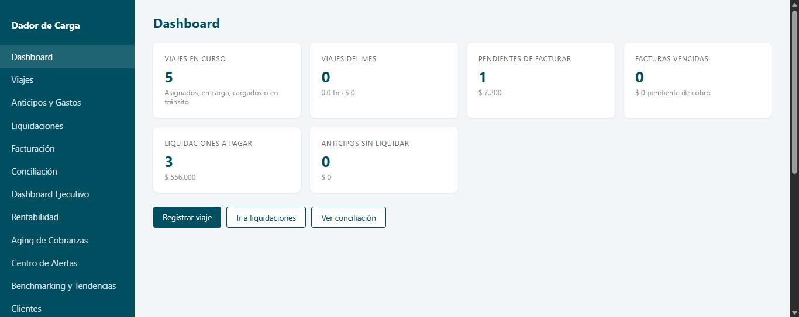

### El menú lateral

A la izquierda de la pantalla hay un menú con las secciones del sistema. **No todas las personas ven las mismas opciones** — cada usuario solo ve las secciones que su rol le permite usar (ver la tabla completa en [Roles del sistema](#12-roles-del-sistema)). Las secciones disponibles son:

| Sección | Para qué sirve |
|---|---|
| Dashboard | Resumen general de la operación |
| Viajes | Alta y seguimiento de viajes |
| Anticipos y Gastos | Registro de adelantos a transportistas/choferes |
| Liquidaciones | Cálculo y pago a transportistas/choferes |
| Facturación | Emisión de facturas a clientes |
| Conciliación | Seguimiento de cobros pendientes |
| Dashboard Ejecutivo, Rentabilidad, Aging de Cobranzas, Centro de Alertas, Benchmarking y Tendencias | Herramientas de análisis para Gerencia/Administración |
| Clientes | Catálogo de clientes |
| Transportistas | Catálogo de transportistas, choferes y vehículos |
| Catálogos | Cereales, Ubicaciones, Tipos de gasto, Productores |
| Mi Organización | Datos de tu empresa dentro del sistema |
| Usuarios, Auditoría Administrativa, Grupo Económico, Pago Consolidado | Administración del sistema (solo rol Administrador) |

### Tu usuario, rol y organización

En la parte inferior del menú lateral aparece tu nombre y, debajo, tu rol (por ejemplo, "OPERACIONES"). Justo debajo se muestra la organización con la que estás trabajando en este momento.

### Selector de organización (si corresponde)

Si tu usuario tiene acceso a **más de una organización** (por pertenecer a un Grupo Económico), en lugar de un texto fijo vas a ver un desplegable con el nombre de cada organización disponible. Al elegir una distinta, el sistema te pregunta **"¿Cambiar a {nombre de la organización}?"** antes de aplicar el cambio. Si tu usuario pertenece a una sola organización, ese nombre se muestra como texto simple, sin desplegable.

*(La administración del Grupo Económico en sí — qué organizaciones lo integran, quién tiene acceso a cuáles — es una pantalla aparte, "Grupo Económico", visible solo para el rol Administrador.)*

---

## 3. Datos iniciales necesarios

Antes de cargar el primer viaje, conviene preparar la información base en este orden:

1. **Mi Organización** — revisá que los datos de tu empresa estén completos.

   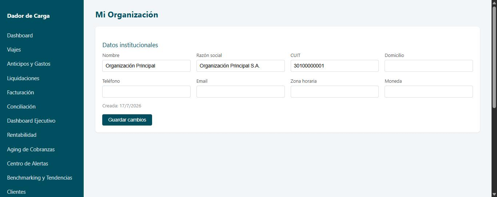
2. **Clientes** — a quién le facturás.
3. **Transportistas** — quién transporta la mercadería.
4. **Choferes** — se cargan *dentro* de cada Transportista, no en una pantalla separada.
5. **Vehículos** — también se cargan *dentro* de cada Transportista.
6. **Catálogos** — Cereales, Ubicaciones, Tipos de gasto y Productores (todos en la sección "Catálogos" del menú, organizados en pestañas).

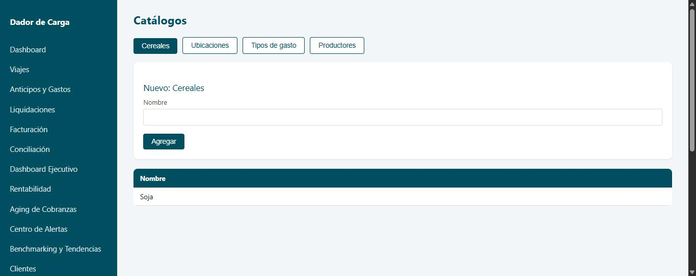

Tener esto cargado de antemano hace que crear un viaje sea mucho más rápido, porque todos estos datos se eligen de listas desplegables.

### Circuito recomendado (resumen)

Este es el recorrido típico de principio a fin, para tenerlo como mapa mental antes de entrar en el detalle de cada pantalla:

**Catálogos → Cliente → Transportista/Chofer/Vehículo → Viaje → Descarga → Anticipo (opcional) → Liquidación → Confirmación → Pago**

En palabras simples: primero preparás los datos base (catálogos, cliente, transportista con su chofer y vehículo); después creás el viaje y lo hacés avanzar hasta que se descarga; en cualquier momento de ese proceso podés registrar un anticipo si el transportista/chofer lo necesitó; y una vez que el viaje está descargado, armás la liquidación, la confirmás y por último la marcás como pagada.

---

## 4. Clientes

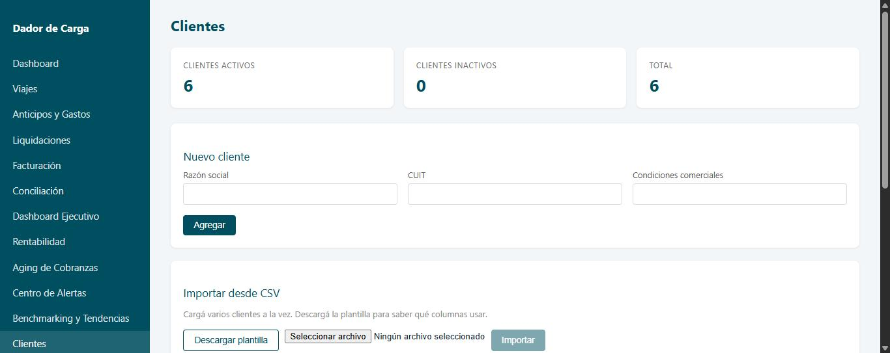

### Crear un cliente

1. En el menú, entrá a **Clientes**.
2. Completá el formulario **"Nuevo cliente"**: Razón social (obligatorio), CUIT (obligatorio), Condiciones comerciales (opcional).
3. Hacé clic en **"Agregar"**.

### Buscar

Usá el campo **"Buscar"** (por razón social o CUIT) y, si querés, el desplegable **"Ordenar por"** (Razón social / Fecha de creación / Estado).

### Editar

Hacé clic en **"Editar"** en la fila del cliente. El formulario cambia a modo edición; guardá con **"Guardar cambios"** o cancelá con **"Cancelar edición"**.

### Desactivar / Reactivar

El botón de cada fila alterna entre **"Desactivar"** y **"Reactivar"**. Desactivar pide confirmación (**"¿Desactivar a {cliente}? Podés reactivarlo en cualquier momento."**) — **no borra el cliente**, solo lo saca de las listas activas. Reactivar no pide confirmación.

### Importar clientes desde un archivo CSV

1. Hacé clic en **"Descargar plantilla"** para obtener el archivo con las columnas correctas.
2. Completá el archivo en Excel u otro programa de planillas, respetando esas columnas.
3. Volvé a la pantalla, elegí el archivo y hacé clic en **"Importar"**.
4. El sistema informa cuántos clientes se crearon y, si hubo rechazos, el detalle fila por fila.

*(la sección "Importar desde CSV" se ve en la misma captura del listado de Clientes, más abajo en la pantalla)*

### Error frecuente: CUIT duplicado

- Si dos filas del **mismo archivo** tienen el mismo CUIT, la segunda se rechaza con: *"CUIT '...' duplicado dentro del archivo."*
- Si el CUIT **ya existe** en el sistema, se rechaza con: *"Ya existe un cliente con CUIT '...' en esta organización."*

En ambos casos, corregí o eliminá esa fila del archivo y volvé a importar solo las filas pendientes.

---

## 5. Transportistas

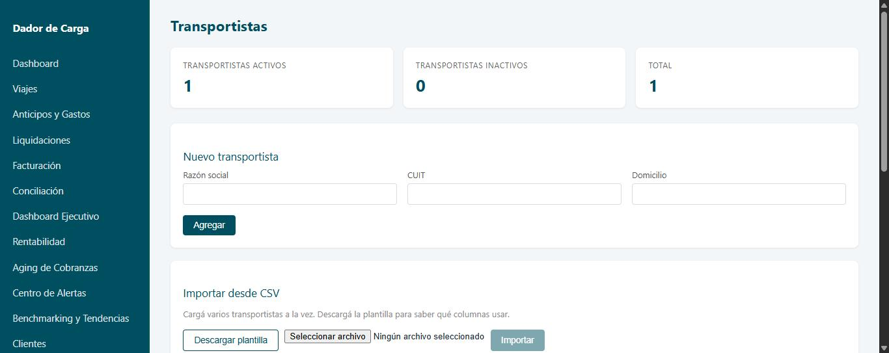

### Crear y editar un transportista

Igual que Clientes: formulario **"Nuevo transportista"** (Razón social, CUIT, Domicilio), botón **"Agregar"**; para editar, **"Editar"** → **"Guardar cambios"**.

### Alta de choferes y vehículos

**Los choferes y vehículos no tienen una pantalla propia en el menú — se cargan desde adentro de cada transportista.**

1. En el listado de Transportistas, hacé clic en **"Ver choferes / vehículos"** en la fila del transportista correspondiente.
2. Se despliega un panel con dos formularios:
   - **Chofer:** Nombre, DNI, CUIL (obligatorio), N° de Licencia, Comisión % — botón **"+ Chofer"**.
   - **Vehículo:** Patente (obligatorio), Marca, Modelo, Tipo (Camión / Acoplado), Capacidad en kg — botón **"+ Vehículo"**.

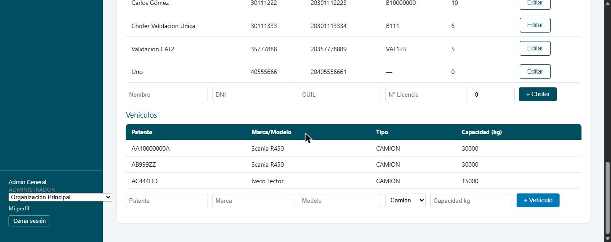

La comisión de un chofer se puede editar más adelante haciendo clic en **"Editar"** junto al valor, en la misma lista.

### Búsqueda y desactivación

Mismo criterio que Clientes: campo "Buscar" (razón social o CUIT), "Ordenar por", y botones "Desactivar"/"Reactivar" con el mismo aviso de que no se borra el registro.

### Importación CSV

Hay **tres importaciones independientes**, cada una con su propia plantilla:

| Importación | Plantilla | Nota |
|---|---|---|
| Transportistas | `plantilla-transportistas.csv` | Alta de transportistas nuevos |
| Choferes | `plantilla-choferes.csv` | El CUIT del archivo identifica a qué transportista (ya existente) pertenece cada chofer |
| Vehículos | `plantilla-vehiculos.csv` | Igual que Choferes: se asocian a un transportista existente por CUIT |

Los mismos dos mensajes de error de CUIT duplicado que en Clientes aplican acá (dentro del archivo / ya existente).

### Normalización de CUIT/CUIL/DNI/patente

El sistema **normaliza automáticamente** estos datos al guardarlos (por ejemplo, saca guiones y espacios de más), tanto al cargar un registro individual como al importar por CSV. Esta normalización ocurre al guardar — **no vas a ver el campo reformatearse visualmente mientras escribís**, así que no te preocupes si al tipear se ve "tal cual" lo escribiste.

---

## 6. Viajes

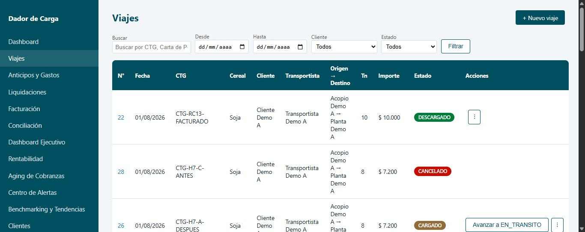

### Crear un viaje

En el menú, entrá a **Viajes** y hacé clic en el botón para crear uno nuevo. Completá:

| Campo | Obligatorio | Notas |
|---|---|---|
| Fecha | Sí | |
| Carta de porte | Sí | Documento que acompaña físicamente la carga |
| CTG | Sí | Código de Trazabilidad de Granos |
| Cereal | Sí | De la lista de Catálogos |
| Cliente | Sí | |
| Productor | No | Opcional |
| Transportista | Sí | |
| Chofer | Sí | Se habilita después de elegir el Transportista |
| Camión | Sí | Solo vehículos tipo Camión |
| Acoplado | No | Opcional, solo vehículos tipo Acoplado |
| Origen / Destino | Sí | De la lista de Ubicaciones |
| Toneladas | Sí | |
| Tarifa por tonelada | Sí | |
| Importe estimado | — | Se calcula solo (Toneladas × Tarifa), no se edita |
| Observaciones | No | Texto libre |

**CTG y Carta de Porte son datos distintos y ambos se guardan** — el CTG es el dato principal que se muestra en las pantallas de Liquidaciones, y la Carta de Porte queda disponible como información complementaria.

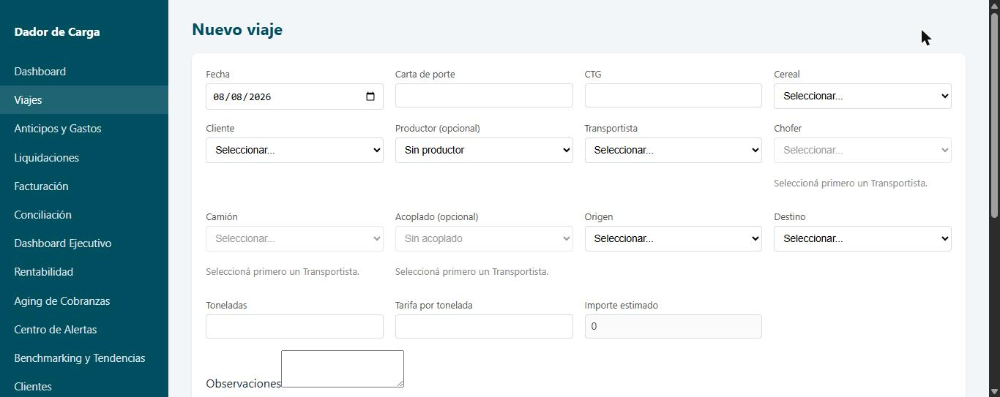

### Estados del viaje

Un viaje avanza, en este orden exacto, sin poder saltar pasos:

**Pendiente → Asignado → En Carga → Cargado → En Tránsito → Descargado**

En palabras simples, qué significa cada uno:

| Estado | En palabras simples |
|---|---|
| **Pendiente** | El viaje está creado, pero todavía no se asignó nada |
| **Asignado** | Ya tiene transportista, chofer y vehículo confirmados |
| **En Carga** | El camión está cargando en el origen |
| **Cargado** | Terminó de cargar, listo para salir |
| **En Tránsito** | Está viajando hacia el destino |
| **Descargado** | Llegó y descargó — a partir de acá el viaje puede facturarse y liquidarse |

Para avanzar, usá el botón **"Avanzar a {siguiente estado}"** en el listado o dentro del detalle del viaje — siempre pasa al estado inmediato siguiente, nunca se puede saltar un paso. También existe **"Cancelar viaje"** (pide un motivo obligatorio), que interrumpe el ciclo en cualquier momento.

Si un viaje ya fue facturado y/o liquidado, el sistema bloquea la edición de la mayoría de sus campos y lo indica con un aviso en pantalla; para modificarlo hay que anular primero la factura y/o la liquidación asociada.

### Para que un viaje aparezca como candidato a liquidar

El viaje tiene que estar en estado **Descargado** y todavía no formar parte de ninguna liquidación (no haber sido ya liquidado).

### Para que un viaje aparezca como candidato a facturar

El viaje tiene que estar en estado **Descargado** y estar pendiente de facturar (no haber sido ya facturado).

Si un viaje "no aparece" donde lo esperás, la causa casi siempre es una de estas dos condiciones sin cumplir — ver también [Buenas prácticas y errores frecuentes](#11-buenas-prácticas-y-errores-frecuentes).

---

## 7. Anticipos y gastos

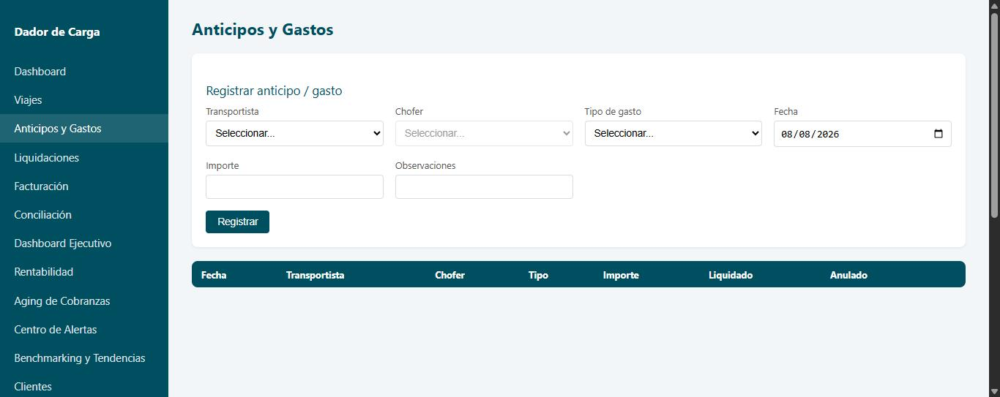

### Registrar un anticipo o gasto

1. Entrá a **Anticipos y Gastos**.
2. Completá: Transportista, Chofer (se habilita después de elegir el Transportista), Tipo de gasto, Fecha (por defecto, hoy), Importe, y opcionalmente Observaciones.
3. Hacé clic en **"Registrar"**.

**Importante:** esta pantalla **no tiene un campo para adjuntar comprobante** — el sistema no guarda una imagen o archivo del comprobante, solo el importe y los datos del gasto. Conservá el comprobante físico o digital fuera del sistema si tu operación lo requiere.

**También importante:** esta pantalla **no permite elegir manualmente a qué viaje corresponde** el anticipo o gasto — un anticipo se registra solo contra un Transportista o un Chofer, nunca contra un viaje puntual.

Esto tiene una consecuencia directa en Liquidaciones: como ningún anticipo queda vinculado a un viaje específico, cuando armás una liquidación y seleccionás anticipos/gastos pendientes, esos importes se descuentan del total de la liquidación como **"Adelantos / gastos generales del período"** — no aparecen "dentro" de la fila de ningún viaje en particular, aunque ese viaje forme parte de la misma liquidación. Ver [Liquidaciones](#8-liquidaciones).

### Anular un anticipo o gasto

Mientras no haya sido usado en una liquidación, el botón **"Anular"** está disponible en cada fila. Pide un motivo obligatorio. El registro anulado queda visible en la tabla, marcado como tal — no desaparece.

---

## 8. Liquidaciones

Esta es la pantalla donde se calcula y se paga a un transportista o chofer por sus viajes, descontando lo que ya recibió como anticipo.

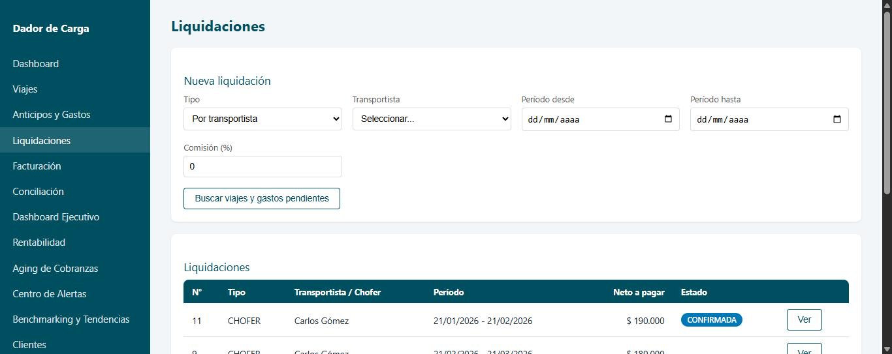

### Paso a paso

1. Entrá a **Liquidaciones**.
2. En **"Nueva liquidación"**, elegí el **Tipo**: "Por transportista" o "Por chofer".
3. Elegí el **Transportista** o **Chofer** correspondiente. Si elegís un chofer, la **Comisión (%)** se completa sola con la comisión guardada en su ficha (se puede modificar como excepción).
4. Completá **Período desde** y **Período hasta**.
5. Hacé clic en **"Buscar viajes y gastos pendientes"**.
6. Aparecen dos tablas: los **viajes pendientes de liquidar** y los **anticipos/gastos pendientes** de ese transportista/chofer en el período elegido.
7. Marcá con el tilde **únicamente** los viajes y anticipos que correspondan a esta liquidación.
8. Hacé clic en **"Crear liquidación (borrador)"**.

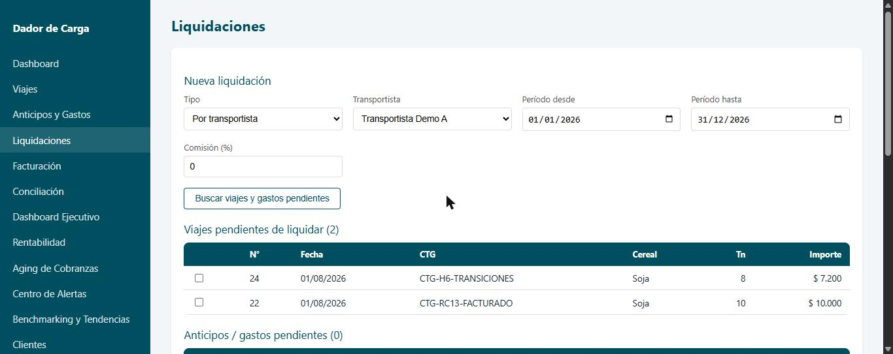

### El detalle de la liquidación

Se abre automáticamente al crearla. Muestra:

- Datos del transportista/chofer, período, importe bruto, descuentos y neto a pagar.
- Una tabla principal con **CTG como dato principal** (Fecha, CTG, Cliente, Origen, Destino, Toneladas, Tarifa, Bruto, Descuentos, Neto).
- El botón **"Ver información completa"** despliega una tabla más detallada, que incluye la **Carta de Porte** como información complementaria, junto con el resto de los datos técnicos de cada viaje.
- Debajo de la tabla de viajes, si seleccionaste anticipos/gastos al crear la liquidación, aparece una tabla aparte: **"Adelantos / gastos generales del período (sin viaje asociado)"**. Ahí es donde se ven los anticipos que descontaste — como se explica en [Anticipos y gastos](#7-anticipos-y-gastos), el sistema no vincula un anticipo a un viaje puntual, así que siempre van a esta tabla general, nunca "adentro" de la fila de un viaje específico.

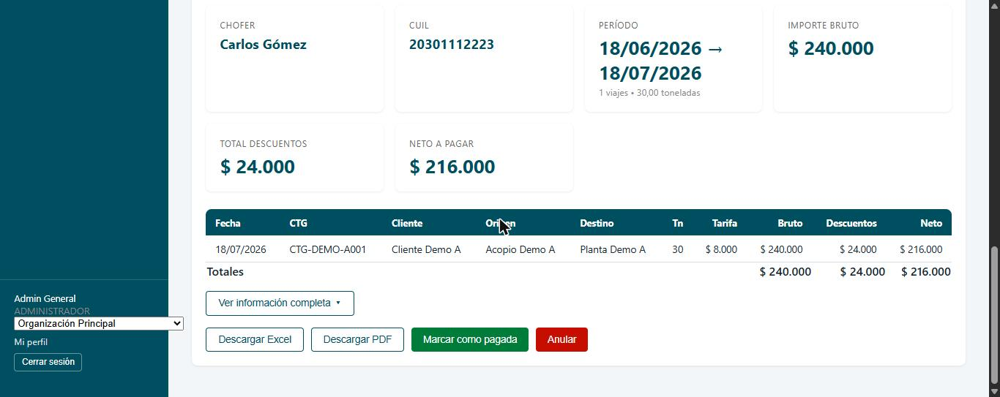

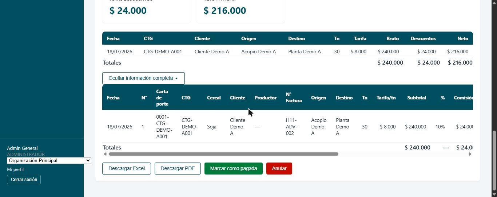

[CAPTURA: Tabla de adelantos/gastos generales del período — pendiente, ver "Capturas pendientes" al final del manual]

### Estados de una liquidación

| Estado | Qué significa |
|---|---|
| **Borrador** | Recién creada, todavía se puede anular libremente |
| **Confirmada** | Ya no admite cambios en su composición, lista para pagar |
| **Pagada** | Ya se marcó como pagada — **no se puede deshacer** |
| **Anulada** | Se revirtió; los viajes y anticipos que tenía vuelven a estar disponibles para una nueva liquidación |

### Acciones y sus avisos

> **Antes de tocar "Confirmar", "Marcar como pagada" o "Anular": revisá el detalle completo (transportista/chofer correcto, período correcto, importes) una vez más.** Estas tres acciones afectan un documento financiero real.

- **"Confirmar"** (solo en Borrador): pregunta *"¿Confirmar la liquidación N° ...? Podrá marcarse como pagada una vez confirmada."*
- **"Marcar como pagada"** (solo en Confirmada): pide escribir el número de liquidación para habilitar el botón, y advierte explícitamente *"Esta acción no se puede deshacer."*
- **"Anular"** (disponible mientras no esté Pagada): avisa cuántos viajes (y anticipos, si corresponde) van a volver a quedar pendientes de liquidar.
- **"Descargar Excel"** y **"Descargar PDF"**: disponibles en cualquier estado, para archivo o para entregar al transportista/chofer.

> **IMPORTANTE — "Marcar como pagada" no tiene vuelta atrás.** Revisá el importe y el destinatario con cuidado antes de confirmar.

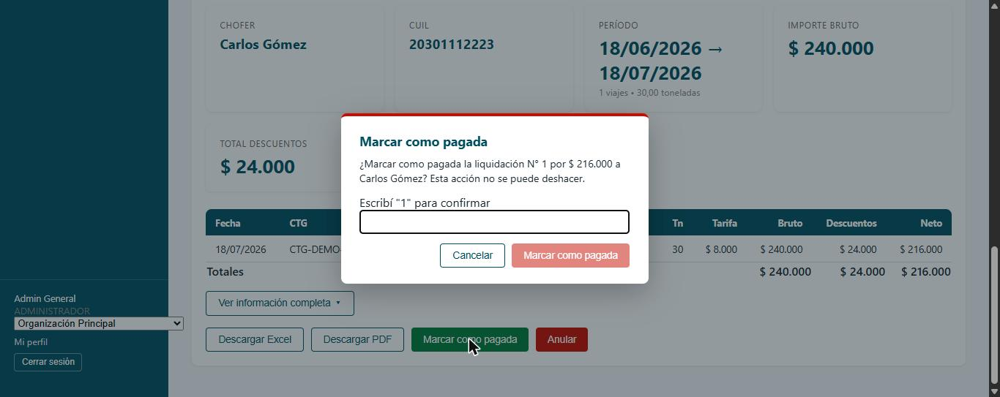

---

## 9. Ejemplo práctico completo

*Ejemplo ficticio, con datos inventados — no corresponde a ninguna operación real.*

1. **Catálogos:** cargá el cereal "Soja" y la ubicación "Acopio Central" (tipo Acopio).
2. **Transportista:** creá "Transporte Ejemplo S.A.", CUIT `30-00000000-1`. Dentro de su ficha, agregá el chofer "Juan Pérez" (CUIL `20-00000000-1`, comisión 5%) y el vehículo patente `AB123CD` (tipo Camión).
3. **Cliente:** creá "Acopiadora Ejemplo S.R.L.", CUIT `30-00000001-2`.
4. **Viaje:** creá un viaje con ese cliente, transportista, chofer y camión; cereal Soja; origen y destino de ejemplo; 30 toneladas; tarifa $1.000/tn. Guardalo, y andá avanzándolo por sus estados hasta **Descargado**.
5. **Anticipo:** registrá un anticipo de $5.000 para ese transportista, con fecha dentro del período que vas a liquidar.
6. **Liquidación:** entrá a Liquidaciones, elegí "Por transportista", el transportista de ejemplo, un período que incluya la fecha del viaje y del anticipo, buscá candidatos, tildá el viaje y el anticipo, y creá la liquidación en borrador.
7. **Confirmar:** revisá el detalle (CTG, importes) y confirmá la liquidación.
8. **Pagar:** marcala como pagada cuando corresponda, escribiendo el número de liquidación para habilitar el botón.

---

## 10. Auditoría Administrativa

*Solo visible para el rol Administrador.*

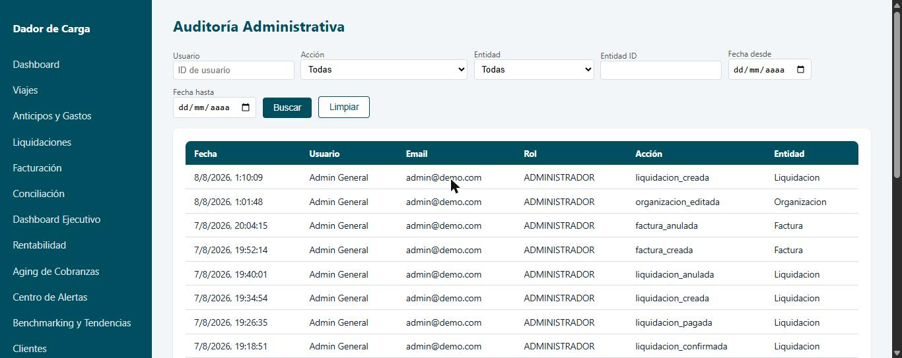

*(las columnas "Entidad ID", "Antes" y "Después" existen en la pantalla real pero no se muestran en esta captura — contienen identificadores internos del sistema.)*

Esta pantalla muestra **quién hizo qué y cuándo** dentro del sistema: creación, edición, anulación y otras acciones sensibles, con la fecha, el usuario responsable y el detalle de qué cambió.

### Filtros disponibles

- **Usuario** (por ID de usuario)
- **Acción** (desplegable, con las acciones realmente registradas)
- **Entidad** (desplegable — por ejemplo, Cliente, Factura, Liquidación)
- **Entidad ID**
- **Fecha desde** / **Fecha hasta**

### Columnas "Antes" y "Después"

Muestran los datos del registro antes y después de la acción, campo por campo. Cualquier dato sensible (contraseñas, tokens, etc.) aparece siempre como **"[oculto]"**, nunca en texto plano.

### Esto es evidencia — no se borra

Los registros de auditoría son el respaldo de qué pasó en el sistema. **No existe ninguna función para eliminarlos**, y no deben tratarse como algo descartable: ante cualquier duda sobre una acción realizada, esta pantalla es la fuente de verdad.

---

## 11. Buenas prácticas y errores frecuentes

| Situación | Qué hacer |
|---|---|
| **CUIT duplicado** al importar o cargar | Revisá si ya existe ese registro (el mensaje lo indica); si es un error de tipeo, corregilo. |
| **Un viaje no aparece como candidato a liquidar** | Confirmá que esté en estado **Descargado** y que no haya sido liquidado ya. |
| **Un viaje no aparece como candidato a facturar** | Confirmá que esté en estado **Descargado** y pendiente de facturar. |
| **Las fechas no traen los viajes esperados** | Revisá que el **Período desde/hasta** de la búsqueda cubra la fecha real del viaje o del anticipo. |
| **Un viaje "no se puede editar"** | Puede estar facturado y/o liquidado — hay que anular esos documentos primero. |
| **Un viaje "ya liquidado" y necesitás corregirlo** | Anulá la liquidación que lo contiene; el viaje vuelve a quedar disponible para una nueva. |
| **Compartir usuario/contraseña entre personas** | Nunca — cada persona debe tener su propio usuario. |
| **Antes de Confirmar, Pagar o Anular una liquidación** | Revisá los importes con cuidado — "Marcar como pagada" **no se puede deshacer**. |
| **Diferencia entre "Anular" y "Eliminar"** | El sistema **nunca borra información**. "Desactivar" (Clientes/Transportistas) solo saca un registro de las listas activas, y se puede reactivar. "Anular" (Viajes/Anticipos/Liquidaciones/Facturas) revierte una acción financiera, pero el registro queda visible como evidencia. No existe una función de "eliminar" en el sentido de borrar datos definitivamente. |
| **La pantalla parece no reflejar un cambio reciente** | Actualizá la página (F5) — algunas pantallas no se refrescan solas después de una acción en otra pestaña. |

---

## 12. Roles del sistema

Esta tabla refleja lo que cada rol puede hacer realmente en el sistema (verificado contra los controles de acceso del sistema, no solo contra lo que muestra el menú).

**El rol Administrador puede realizar cualquier acción del sistema, sin excepción — no está limitado por esta tabla.**

| Módulo | Puede ver | Puede crear / editar / confirmar / anular |
|---|---|---|
| Viajes | Todos los roles | Operaciones |
| Anticipos y Gastos | Todos los roles | Liquidaciones, Operaciones |
| Liquidaciones | Todos los roles | Liquidaciones |
| Facturas y Cobranzas | Todos los roles | Facturación |
| Clientes | Todos los roles | Operaciones, Facturación |
| Transportistas | Todos los roles | Operaciones |
| Choferes (dentro de Transportistas) | Todos los roles | Operaciones, Liquidaciones |
| Vehículos (dentro de Transportistas) | Todos los roles | Operaciones |
| Catálogos — Cereales, Ubicaciones, Productores | Todos los roles | Operaciones |
| Catálogos — Tipos de gasto | Todos los roles | Operaciones, Liquidaciones |
| Mi Organización (ver) | Todos los roles | — |
| Mi Organización (editar datos) | — | Solo Administrador |
| Usuarios | — | Solo Administrador |
| Auditoría Administrativa | — | Solo Administrador (ver) |
| Grupo Económico / Pago Consolidado | — | Solo Administrador |
| Dashboard Ejecutivo, Rentabilidad, Benchmarking | — | Administrador, Gerencia |
| Aging de Cobranzas | — | Administrador, Gerencia, Facturación |
| Centro de Alertas | — | Administrador, Gerencia, Facturación, Liquidaciones, Operaciones |

*Nota: "Puede ver" refiere a que el dato es accesible; el menú lateral, además, oculta la entrada a algunas secciones según el rol (ver [Pantalla principal](#2-pantalla-principal)) para simplificar lo que cada usuario ve a diario.*

---

## 13. Soporte

Si encontrás un problema, enviá esta información a quien te dé soporte técnico:

1. **Captura de pantalla** del problema (sin recortar el mensaje de error, si hay uno).
2. **Fecha y hora** exactas en que ocurrió.
3. **Sección** del sistema en la que estabas (por ejemplo, "Liquidaciones").
4. **Qué acción intentabas hacer** (por ejemplo, "marcar la liquidación N° 12 como pagada").
5. **El mensaje de error exacto**, tal como lo mostró el sistema.

**Nunca envíes tu contraseña** por email, chat o ningún otro medio — nadie del equipo de soporte necesita conocerla para ayudarte.

---

## Capturas pendientes

16 de 18 capturas ya están incorporadas al manual, tomadas contra el entorno local con datos de demostración (nunca contra producción). Quedan pendientes exactamente 2:

1. **Pantalla de recuperación de contraseña** — no se generó en esta pasada; no requiere ninguna escritura, se puede capturar en cualquier momento navegando a `/recuperar-contrasena` sin enviar el formulario.
2. **Tabla "Adelantos / gastos generales del período"** dentro del detalle de una Liquidación — no se pudo capturar porque **ninguna liquidación existente en el entorno de demostración tiene anticipos/gastos asociados** (todas las liquidaciones con datos reales solo tienen viajes). Generarla requeriría crear un anticipo nuevo y una liquidación nueva que lo incluya — una escritura real, fuera de lo permitido en esta tarea. Queda documentada como limitación, no como capturas omitida por descuido.
